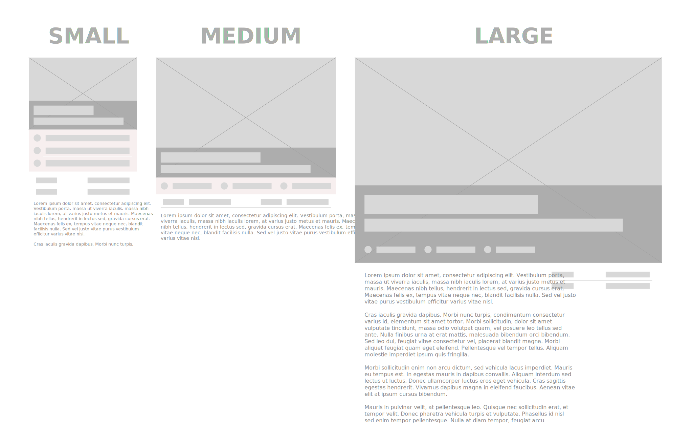
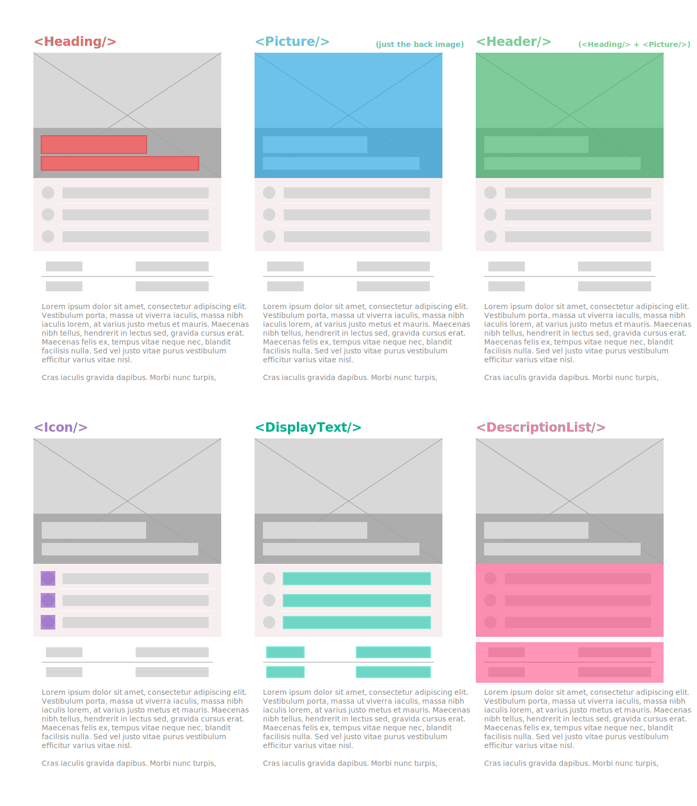

# styled-responsive-theming
styled-components theming with responsive skills 💅💪

- [Disclaimer](#disclaimer)
- [Installation](#installation)
- [Spoiler](#spoiler)
- [Run the demo](#run-the-demo)
- [Motivation](#motivation)
- [Docs](#docs)
  * [ThemeManager](#thememanager)
    + [createTheme(componentName, componentThemes)](#createthemecomponentname-componentthemes)
    + [getTheme(themePath)](#getthemethemepath)
  * [BaseTheme](#basetheme)
  * [Theme](#theme)
- [Known Issues](#known-issues)

## Disclaimer

This project is a mere PROOF OF CONCEPT as no tests have been implemented, the implementation is dirty and the API is extremely sensitive to change. We would discourage you from using this in a production environment but if you are brave (and maybe a bit crazy also 🙈) and you decide to use it anyway, your feedback, PR, issues or anything that could help will be very very welcome.

## Installation

```bash
  yarn add styled-responsive-theming
```

## Spoiler
In case you are too busy to read the documentation, there is a spoiler for you:

```jsx
// App.js
import { BaseTheme, Theme, ThemeManager } from 'styled-responsive-theming'

import Button from './Button'

const breakpoints = [
  '480px',
  '600px',
  '840px',
  '960px',
  '1280px',
  '1440px',
  '1600px',
  '1920px'
]

const App = () => (
  <BaseTheme breakpoints={breakpoints}>
    <Button>Default Button</Button>

    <Theme overrideWith={{
      Button: {
        backgroundColor: ['palevioletred', 'papayawhip',,, 'palevioletred'] // Responsive property (just like with styled-system but in the theme)
      }
    }}>
      <Button>Responsive Background Button</Button>
    </Theme>

    <Theme overrideWith={{
      Button: ThemeManager.getTheme('Button.extraBordered')
    }}>
      <Button>Extra Bordered Button</Button>
    </Theme>
  </BaseTheme>
)
```

```js
// Button.js
import styled, { css } from 'styled-components'
import { ThemeManger } from 'styled-responsive-theming'

const applyButtonTheme = ThemeManager.createTheme('Button', {
  default: {
    fitContent: false,
    radius: '0.25em',
    backgroundColor: 'black',
    borderColor: 'white',
    borderWidth: '0.125em',
    hoverBackgroundColor: 'springgreen',
    hoverBorderColor: 'white',
    hoverTextColor: 'white',
    textColor: 'white'
  },
  extraBordered: {
    radius: '1em'
  }
})

const Button = styled.button`
  display: flex;
  justify-content: center;
  align-items: center;

  text-transform: uppercase;
  border-style: solid;

  transition-property: background-color, border-color, color;
  transition-duration:  0.3s;

  outline: none;
  padding: 0.5em 1em;

  ${applyButtonTheme(({
    fitContent,
    radius,
    borderWidth,
    backgroundColor,
    borderColor,
    textColor,
    hoverBackgroundColor,
    hoverBorderColor,
    hoverTextColor
  }) => css`
    background-color: ${backgroundColor};
    border-color: ${borderColor};
    border-width: ${borderWidth};

    color: ${textColor};

    border-radius: ${radius};

    &:hover {
      background-color: ${hoverBackgroundColor};
      border-color: ${hoverBorderColor};
      color: ${hoverTextColor};
    }

    width: ${fitContent ? 'auto' : '100%'};
  `)}
`

export default Button
```

## Run the demo

Clone this repo and `yarn && yarn start`:

```bash
git clone https://github.com/d-asensio/styled-responsive-theming

cd ./styled-responsive-theming

yarn && yarn start
```

## Motivation

As it happens with a vast majority of libraries, the need to develop "styled-responsive-theming" has born naturally while developing a real-world product. That product is not mature enough to be published either mentioned here. Instead I will show you some practical use-cases which triggered the very first spark of thought that encouraged us to start with this proof of concept and hopefully an upcoming well-defined and solid library.

Few months ago, our designer asked us to implement a design like the following:



Next, we started a discussion about how to split down the design in small, composable, reusable components following the single responsibility principle, so we ended up with the following decomposition:



At that moment we were using [styled-system](https://github.com/jxnblk/styled-system) and taking advantage of its awesome responsive props, "this is a piece of cake!" we thought... But then we started to develop our `DescriptionList` component and there is where the nightmare started.

The problem was that we ended up with a component way more complex than we expected at the beginning, in other words... it was a mess for the consumer to use it. To illustrate this in a simplified way, here goes the interface of what we implemented first:

```jsx
const PrimaryDescriptionList = () => (
  <DescriptionList
    flexDirection={['column', 'row']}
  >
    <DescriptionList.Item
      mr={[0, 4]}
    >
      <DescriptionList.Label>Label 1</DescriptionList.Label>
      <DescriptionList.Detail>Detail 1</DescriptionList.Detail>
    </DescriptionList.Item>
    <DescriptionList.Item
      mr={[0, 4]}
    >
      <DescriptionList.Label>Label 2</DescriptionList.Label>
      <DescriptionList.Detail>Detail 2</DescriptionList.Detail>
    </DescriptionList.Item>
    <DescriptionList.Item
      mr={[0, 4]}
    >
      <DescriptionList.Label>Label 3</DescriptionList.Label>
      <DescriptionList.Detail>Detail 3</DescriptionList.Detail>
    </DescriptionList.Item>
  </DescriptionList>
)
```

```jsx
const SecondaryDescriptionList = () => (
  <DescriptionList
    flexDirection={['column', 'row', 'column']}
    justifyContent={'space-between'}
  >
    <DescriptionList.Item
      justifyContent={['space-between', 'flex-start', 'space-between']}
      mr={[0, 4, 0]}
    >
      <DescriptionList.Label>Label 1</DescriptionList.Label>
      <DescriptionList.Detail>Detail 1</DescriptionList.Detail>
    </DescriptionList.Item>
    <DescriptionList.Item
      justifyContent={['space-between', 'flex-start', 'space-between']}
      mr={[0, 4, 0]}
    >
      <DescriptionList.Label>Label 2</DescriptionList.Label>
      <DescriptionList.Detail>Detail 2</DescriptionList.Detail>
    </DescriptionList.Item>
  </DescriptionList>
)
```

Take a look to the full (bare) implementation [here](https://github.com/d-asensio/styled-system-description-list)

Of course we weren't very comfortable with the above interface. The reasons:

- __This way enforces specific patterns:__ As we needed to define the responsive behavior of different parts of our component, we were forced to use the _Compound Components_ pattern (explanation [here](https://blog.kentcdodds.com/advanced-react-component-patterns-56af2b74bc5f)) so we decided to use a BEM-like convention as described in [styled-components-modifiers](https://github.com/Decisiv/styled-components-modifiers). In this case though, and this is very opinionated, we consider that would be much better to use the _Render Props_ pattern (explanation [here](https://blog.kentcdodds.com/advanced-react-component-patterns-56af2b74bc5f) as well) which would make our component more readable.

- __Block and Elements props are completely decoupled:__ If you take a look at the `flexDirection` prop of the main `DescriptionList` component (Block), and compare it with the `mr` prop of the `DescriptionList.Item` component (Element), you will perceive a sort of symmetry. Why? Well, regarding the design, you will see that the two lists below the header have two modes, say `column` and `row`, that translated to css means:
  - _If the component is said to render in column:_ set `flex-direction: column;` for the parent and `margin-right: 0;` for the children.
  - _If  the component is said to render in row:_ set `flex-direction: row;` for the parent and `margin-right: 1em;` for the children.

  So the problem is that the consumer will have to know that and will have to keep those properties in sync to not to break the consistency of the component if the responsive behavior change.

Those among others where the reasons why we started to think that we needed another way to control the responsive behavior of components that size. And that's not because [styled-system](https://github.com/jxnblk/styled-system) is not a good library (is great), it is because its design have been thought to create very atomic components, and `DescriptionList` is much more like a molecule, using the [Atomic Design](http://bradfrost.com/blog/post/atomic-web-design/) jargon.

## Docs

### ThemeManager

`ThemeManager` is a [singleton](https://addyosmani.com/resources/essentialjsdesignpatterns/book/index.html#singletonpatternjavascript) that will allow you create themes for your components. It will collect all the themes you create to allow you access them from everywhere.

#### createTheme(componentName, componentThemes)

To create a theme for your component you have to provide a `default` set of properties, from that moment on, you can just extend the default properties by overriding them adding extra sets. In the following example you will see the definition of a theme for a `Button` component, which has two sets of properties, the `default` set and the `extraBordered` set. This last set of properties will override the radius of the `default` theme and will keep the rest of them intact.

Let's see the code:

```jsx
import { ThemeManger } from 'styled-responsive-theming'

const applyButtonTheme = ThemeManager.createTheme('Button', {
  default: {
    fitContent: false,
    radius: '0.25em',
    backgroundColor: 'black',
    borderColor: 'white',
    borderWidth: '0.125em',
    hoverBackgroundColor: 'springgreen',
    hoverBorderColor: 'white',
    hoverTextColor: 'white',
    textColor: 'white'
  },
  extraBordered: {
    radius: '1em'
  }
})
```

Once your theme is created you can use it as a helper to style your component:

```js
const Button = styled.button`
  display: flex;
  justify-content: center;
  align-items: center;

  text-transform: uppercase;
  border-style: solid;

  transition-property: background-color, border-color, color;
  transition-duration:  0.3s;

  outline: none;
  padding: 0.5em 1em;

  ${applyButtonTheme(({
    fitContent,
    radius,
    borderWidth,
    backgroundColor,
    borderColor,
    textColor,
    hoverBackgroundColor,
    hoverBorderColor,
    hoverTextColor
  }) => css`
    background-color: ${backgroundColor};
    border-color: ${borderColor};
    border-width: ${borderWidth};

    color: ${textColor};

    border-radius: ${radius};

    &:hover {
      background-color: ${hoverBackgroundColor};
      border-color: ${hoverBorderColor};
      color: ${hoverTextColor};
    }

    width: ${fitContent ? 'auto' : '100%'};
  `)}
`

export default Button
```
And your component is all set.

#### getTheme(themePath)

You can get the property sets of your component's theme from everywhere, just import the `ThemeProvider` and provide your theme's path to the `getTheme` method.

Just like that:

```jsx
import { ThemeManger } from 'styled-responsive-theming'

const allButtonThemes = ThemeManager.getTheme('Button')
/*  Will return:
    {
      default: {
        fitContent: false,
        radius: '0.25em',
        backgroundColor: 'black',
        borderColor: 'white',
        borderWidth: '0.125em',
        hoverBackgroundColor: 'springgreen',
        hoverBorderColor: 'white',
        hoverTextColor: 'white',
        textColor: 'white'
      },
      extraBordered: {
        radius: '1em'
      }
    }
*/

const buttonDefaultTheme = ThemeManager.getTheme('Button.default')
/*  Will return:
    {
      radius: '1em'
    }
*/
```

### BaseTheme

At the moment of integrating your component in an app you have to put the `BaseTheme` at the root of it. `BaseTheme` will inject all your component's themes in the [react-context](https://reactjs.org/docs/context.html) of your app using the [ThemeProvider](https://www.styled-components.com/docs/advanced#theming) from styled-components.

In order to apply the responsive properties of your themes correctly, `BaseTheme` need to know the `breakpoints` of your app.

```jsx
import { BaseTheme } from 'styled-responsive-theming'

import Button from './Button'

const breakpoints = [
  '480px',
  '600px',
  '840px',
  '960px',
  '1280px',
  '1440px',
  '1600px',
  '1920px'
]

const App = () => (
  <BaseTheme breakpoints={breakpoints}>
    <Button>Default Button</Button>
  </BaseTheme>
)
```

### Theme

Use `Theme` when you want to create a scope of components with a different theme, overriding the theme in the parent scope.

Like this:

```jsx
const App = () => (
  <BaseTheme breakpoints={breakpoints}>
    <Button>Default Button</Button>

    <Theme overrideWith={{
      Button: {
        backgroundColor: ['palevioletred', 'papayawhip',,, 'palevioletred'] // Responsive property (just like with styled-system but in the theme)
      }
    }}>
      <Button>Responsive Background Button</Button>
    </Theme>
  </BaseTheme>
)
```

You can apply preset themes by accessing to them via `ThemeProvider.getTheme()`:

```jsx
const App = () => (
  <BaseTheme breakpoints={breakpoints}>
    <Button>Default Button</Button>

    <Theme overrideWith={{
      Button: ThemeManager.getTheme('Button.extraBordered')
    }}>
      <Button>Extra Bordered Button</Button>
    </Theme>
  </BaseTheme>
)
```


## Known Issues

- __Redundant css generation__: When a responsive property of a theme is applied, the css of the component that is provided to the helper generated with `ThemeManager.createTheme()` is wrapped in different media queries (one for each breakpoint defined by the responsive property). Each media query contain all the properties of that piece of css, even if they do not change in comparison whit the previous breakpoint.

  I think this can be fixed by comparing the css that is being wrapped in each media query with the css in the media query with the previous breakpoint, and deleting the redundant css properties.
